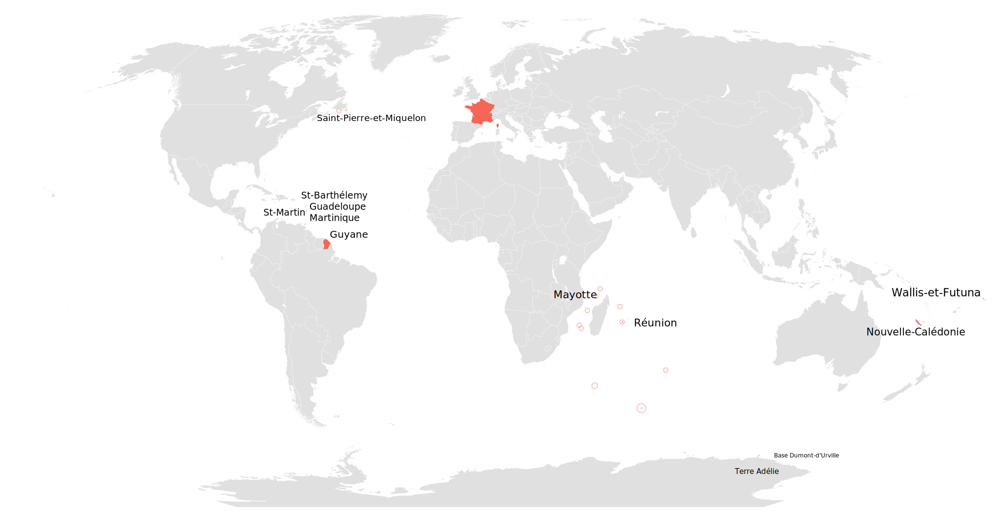
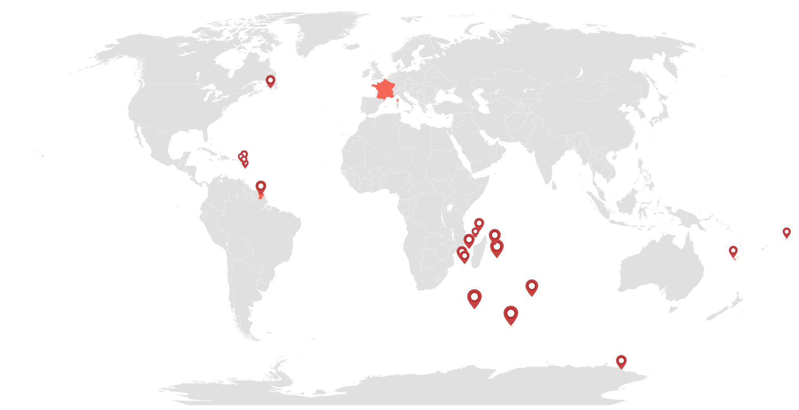

class: cover
background-image: url(images/clock-time-stand-by-38267.jpeg)
background-size: cover

# Manipulating Time in Elm

---

# Who am I?


### Vincent Billey

### Developer [@Synbioz](https://twitter.com/synbioz)


### @Fenntasy on [Twitter](https://twitter.com/Fenntasy) and [Github](https://github.com/Fenntasy)

---
class: inverse

---
class: cover
background-image: url(images/plank-time.jpg)
background-size: contain
background-position: center

---
class: cover
background-image: url(images/time-is-complex.jpg)
background-size: cover

---
class: cover
background-image: url(images/calendar.jpg)
background-size: cover

# Dates
---

## When is today?

--

```elm

type alias Model =
    { date : Maybe Date.Date }

```

---

## When is today?

```elm

type alias Model =
    { date : Maybe Date.Date }


init =
    ( { date = Nothing }
    , Date.now
      |> Task.perform SetToday
    )

```

---

## When is today?

```elm

type alias Model =
    { date : Maybe Date.Date }


init =
    ( { date = Nothing }
    , Date.now
      |> Task.perform SetToday
    )


type Msg
    = SetToday Date.Date

```

---

## When is today?

```elm

type alias Model =
    { date : Maybe Date.Date }


init =
    ( { date = Nothing }
    , Date.now
      |> Task.perform SetToday
    )


type Msg
    = SetToday Date.Date


update msg model =
    case msg of
        SetToday date ->
            ( { model | date = Just date }, Cmd.none )
```

[See on Ellie](https://ellie-app.com/3nZ2YRLBdfGa1/0)
---
class: center

## rluiten/elm-date-extra

--
```elm
today =
  Date.Extra.Create.dateFromFields 2017 Date.Jun 9 10 0 0 0
```

--

```elm
usFormatedDate : Date.Date -> String
usFormatedDate =
  let
    config = Date.Extra.Config.Config_en_us.config
  in
    Date.Extra.Format.format config config.format.longDate
```

--

`Friday, June 09, 2017`


[See on Ellie](https://ellie-app.com/3nVNnVDv8m7a1/0)

---
class: center

## rluiten/elm-date-extra
--

### create
--

### compare
--

### calculate durations
--

### translate

---
class: center, middle

# BUT

---
class: center, middle

> Please be warned that there are many ways to manipulate dates that produce basically incorrect results.


---
class: cover
background-image: url(images/clocks.jpg)
background-size: cover

#  &nbsp; Timezones &nbsp; 

---
class: cover
background-image: url(images/Standard_World_Time_Zones.png)
background-size: contain
background-position: center

---
class: cover
background-image: url(images/australia.png)
background-size: contain
background-position: center

---
class: cover
background-image: url(images/australia2.png)
background-size: contain
background-position: center

---
class: cover
background-image: url(images/australia3.png)
background-size: contain
background-position: center

---
class: cover
background-image: url(images/australia4.png)
background-size: contain
background-position: center

---

`elm-community/elm-time`

--

### Pure Elm dates and time with Records

--

### No translation though

--

### Heavier package

---
class: middle, center

<video loop autoplay preload width="100%">
  <source src="images/HUGE.mp4" />
</video>

---

## Timezone

~~~elm
import Time.TimeZones exposing (australia_eucla)
import Time.ZonedDateTime exposing (zonedDateTime, zero, toTimestamp)

displayTime : Time.Time -> String

main : Html.Html msg
main =
    let
        timezone =
            australia_eucla ()

        date =
            zonedDateTime timezone
                { zero
                    | year = 2017
                    , month = 2
                    , day = 23
                    , hour = 16
                }
    in
        text (toTimestamp date |> displayTime) -- 2017 Feb 23 8:15
~~~

[See on Ellie](https://ellie-app.com/3pq4GzDpFh4a1/0)

---
class: cover white



---
class: cover white



---

# Takeaways

--

## Don't ignore time zones when building apps

--

## Don't trap yourself with built-in Dates

--

## Think about what you want to do

--

## [bit.ly/elm-europe-time](http://bit.ly/elm-europe-time)
