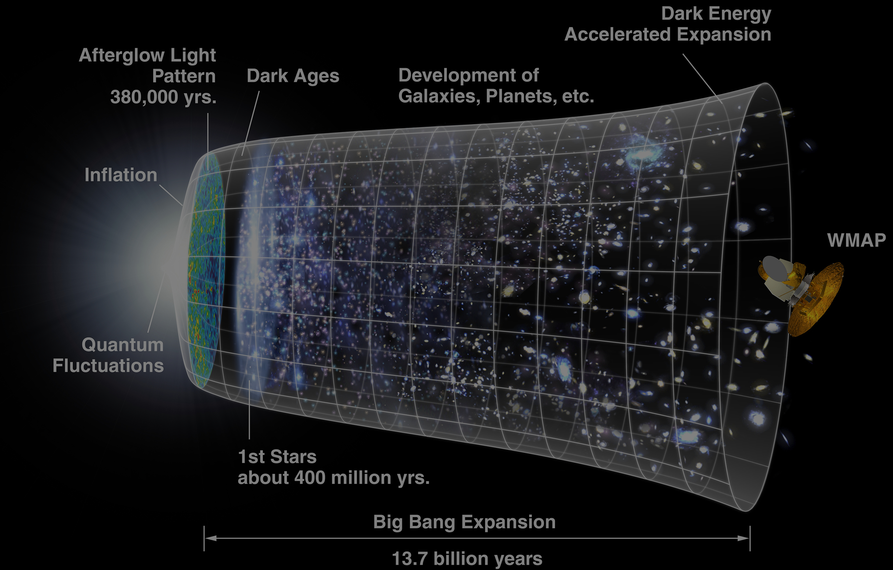

# Manipulating Time in Elm

---

# Who am I?

## Vincent Billey

### Developer @Synbioz

### @Fenntasy on twitter and github

---

# Time is complex

--

## Just ask theoritical physicists

---

# Dates are confusing

--

## What is the first day of the week?

--

## What year is it by the way?

---

# Timezones are worse

--

## You think you know about them?

---

---

## We are lucky in France!

--

### DOM TOM?

--

### There are 12 timezones if you count all territories

--

> Really nothing good came out of colonialism

---

## But how does Elm manage this?

--

~~~javascript
// core/src/Native/Date.js

function fromString(str) {
* var date = new Date(str);
  return isNaN(date.getTime())
    ? _elm_lang$core$Result$Err('Unable to parse \''
        + str
        + '\' as a date. Dates must be in the ISO 8601 format.')
    : _elm_lang$core$Result$Ok(date);
}

*fromTime: function(t) { return new Date(t); },
~~~

---

> For all the talk about performance in the JS ecosystem.
> Few will blame you for using moment.

--

- 21 kb for moment
--

- 68 kb if you add locales
--

- between 3 and 26 kb if you want timezone support

---

## That being said, Elm will help you!

--

### Months are a Union Type

--

### `fromString : String -> Result String Date`

--

### `now : Task x Date`

--

## And the community is here to help

---

## rluiten/elm-date-extra

--

### Comparison

---

## rluiten/elm-date-extra

### Translation

---

## rluiten/elm-date-extra

### Creation

---

## rluiten/elm-date-extra

### Duration

---

## rluiten/elm-date-extra

> Please be warned that there are many ways to manipulate dates that produce basically incorrect results.

---

## Bogdanp/elm-time

--

### when you need the big guns

--

### Pure Elm dates and time (and timezones) with Records

--

~~~elm
> date 1992 2 28
Date { year = 1992, month = 2, day = 28 } : Date
~~~