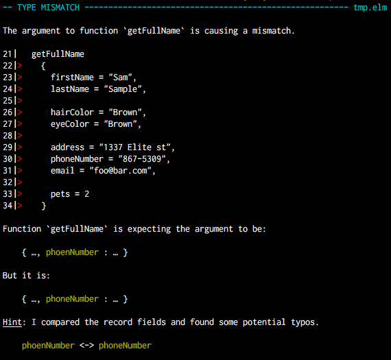

class: cover
background-image: url(images/gwen-weustink-95871.jpg)
background-size: cover

# Comment je me suis réconcilié avec les types

---

# Qui suis-je ?


### Vincent Billey

<h3 style="display: flex; align-items: center; justify-content: center;">
  Developer&nbsp;
  <a href="https://twitter.com/_fewlines">
    
  </a>
</h3>

### @Fenntasy on [Twitter](https://twitter.com/Fenntasy) and [Github](https://github.com/Fenntasy)

---
class: cover
background-image: url(images/josh-nezon-11312.jpg)
background-size: cover

# Une petite histoire

---
class: cover
background-color: black
background-image: url(images/Leelh6.jpg)
background-size: 100%

--


--


--


---
class: cover
background-color: black
background-image: url(images/metod.png)
background-size: 100%

--


---
class: cover
background-image: url(images/synbioz.png)
background-size: cover

--


---
class: cover


---
class: cover

> Do you want to use Elm just because

> it’s the latest thing?

---
class: cover

> Can we afford not to do future projects in Elm?

--

<div style="position: absolute; bottom: 5%;">
  <a href="https://pragmaticstudio.com/blog/2017/4/5/integrating-elm-at-clarity-voice-part2">
    https://pragmaticstudio.com/blog/2017/4/5/integrating-elm-at-clarity-voice-part2
  </a>
</div>

---



---
class: center, middle, cover

```elm
type Msg
    = NoOp
    | ChangeZoom Zoom
    | CurrentDate Date.Date
    | GetData Data
    | ToggleItem Int
    | DraggedOver (Maybe Cell)
    | ToggleWeekends
```

---
class: cover
background-image: url(images/lillefp.png)
background-position: 50% 20%

<div style="position: absolute; bottom: 5%;">
  <a href="http://meetup.com/Lille-FP/">
    <h3>meetup.com/Lille-FP</h3>
  </a>
  <a href="http://bit.ly/lillefp-youtube">
    <h3>bit.ly/lillefp-youtube</h3>
  </a>
</div>
